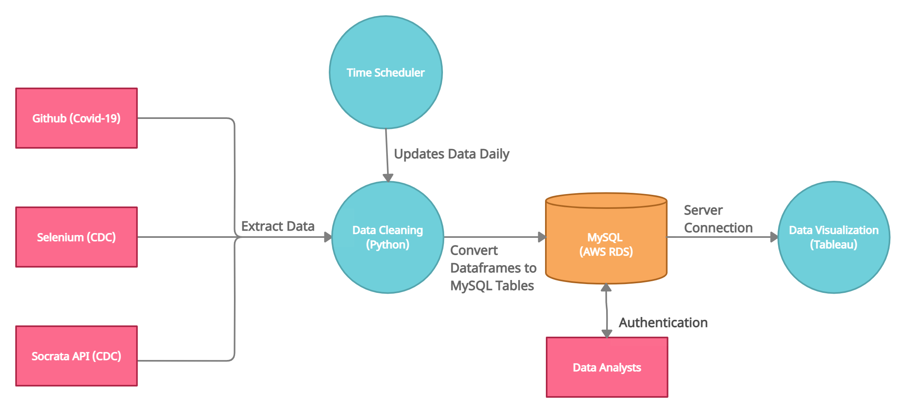

## About the Project
The goal of this project is to find insights about the Covid-19 vaccine distribution and demographic. Below is an explanation of how I automated the extraction of data from different data sources.

The database I used was MySQL. I decided to our host our teams database with AWS using their Relational Database Service (RDS).

Once everyone is connected to AWS, we then connected to a data visualiztion software called Tableau to create dashboards. 

I used Python, Pandas, and SqlAlchemy in order fetch data from the CDC API. Once I pulled the data, I converted the datasets into separate dataframes. After, I used the '.to_sql' function in the Pandas library to convert the dataframes to MySQL Tables and connected them to my AWS Server. 
3 datasets from the CDC API: 
1. J&J Vaccine Results - [Dataset](https://data.cdc.gov/Vaccinations/COVID-19-Vaccine-Distribution-Allocations-by-Juris/w9zu-fywh)
2. Moderna Vaccine Results - [Dataset](https://data.cdc.gov/Vaccinations/COVID-19-Vaccine-Distribution-Allocations-by-Juris/saz5-9hgg)
3. Pfizer Vaccine Results -  [Dataset](https://data.cdc.gov/Vaccinations/COVID-19-Vaccine-Distribution-Allocations-by-Juris/b7pe-5nws)

In order to obtain the 3 datasets below, I had to use Selenium because these datasets did not have any API endpoints. I used Selenium to download each dataset. Source: [Covid-19 Vaccinations in the US - Demographic ](https://covid.cdc.gov/covid-data-tracker/#vaccination-demographic)
1. Race/Ethnicity of People Fully Vaccinated
2. Age Groups of People Fully Vaccinated
3. Sex of People Fully Vaccinated

### DFD

## Technologies
* Python
  * Selenium
  * Pandas
  * SqlAlchemy 
* MySQL
* AWS RDS (Relational Database Service )
* Tableau 
